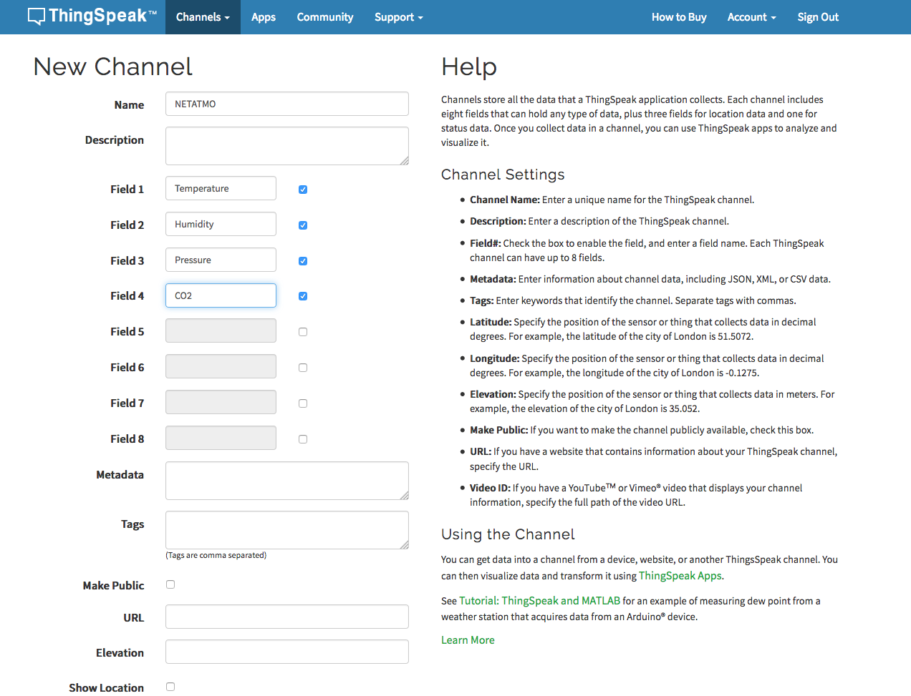
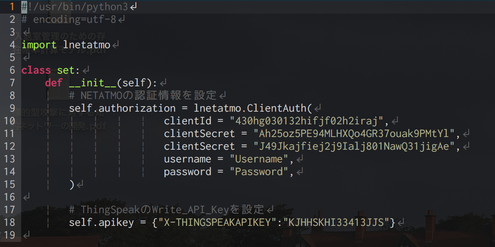

#### <span style="color: red; "> 注1 : 学内向けに作成 </span>
#### <span style="color: red; "> 注2 : Ubuntu(Linux) or RaspbianOSで操作することを前提とする </span>


### 目次
1. [環境構築](#1)
2. [NETATMOのアカウント作成](#2)
3. [ThingSpeakのアカウント作成](#3)
4. [プログラムの実行方法](#4)

### <a name='1'> 1. 環境構築 </a>
##### Ubuntuのアップデート
```
$ sudo apt-get update
$ sudo apt-get upgrade
```
##### Python3系のインストール
```
$ sudo apt-get install -y python3
$ sudo apt-get install -y python3-pip
```

##### 今回使用するPythonライブラリのインストール
```
$ pip3 install lnetatmo
$ pip3 install urllib3
```
##### githubからソースコードを落としてくる
```
$ cd ~
$ git clone https://github.com/tyanogi/manage_netatmo.git
```
<br>

### <a name='2'> 2. NETATMOの設定 </a>
#### ・ アカウントの作成
1. 下のリンクからNETATMOのアカウントを作成する.  
https://auth.netatmo.com/en-US/access/signup?next_url=https%3A%2F%2Fdev.netatmo.com%2Fmyaccount
2. 作成したアカウントでログインを行う.
3. CREATE AN APPをクリックする.
4. 出現したフィールドのName, Descriptionカラムに適当な文字を入力しSAVEボタンを押す.

#### ・ NETATMOの機器をアカウントに接続する
1. 下のリンクからログインする.（アカウント作成時のURLからログインすると違う場所に遷移するため注意）  
https://auth.netatmo.com/
2. 設定ボタンを選択し, 戻るボタンを押す.
3. 新しいステーションをインストールを選択.
4. セットアップウィザードをダウンロードにセットアップを行う.
<br><br>

### <a name='3'> 3. ThingSpeakの設定 </a>
#### ・ アカウントの作成
1. 下のリンクからThingSpeakのアカウントを作成する.  
https://thingspeak.com/users/sign_up
2. 作成したアカウントでログインする.
3. New Channelをクリックする.
4. Nameにチャンネルの名前を入力する.  
   Field1にTemperatureを入力する.  
   Field2にHumidityを入力する.  
   Field3にPressureを入力する.  
   Field4にCO2を入力する.
   ##### 下記はイメージ図  
   
   <br><br>
5. SaveChannelを押して保存.
<br><br>

### <a name='4'> 4. プログラムの実行方法 </a>
#### ・ ~/authinfo.pyに認証情報を登録する
##### 1. NETATMOの認証情報を登録
1. 上記で作成したNETATMOアカウントでログインする.
2. 上記で作成したAppを選択する.
3. TECHNICAL PARAMETERSフィールドのClient id, Client secretをauthinfo.pyのclientID, clientSecretに入力する.
4. authinfo.pyのusername, passwordにNETATMOで登録したユーザーネーム, パスワードを入力する.

##### 2. ThingSpeakの認証情報を登録する
1. 上記で作成たThingSpeakのアカウントでログインする.
2. 上記で作成したチャンネルを選択する.
3. API Keysを選択する.
4. Write API KEYのKeyをsuthinfo.pyのself.apikeyに入力する.

##### 下記はイメージ図（データはダミー）

<br><br>

#### ・ プログラムのデーモン化
##### <span style="color: red; "> 注 : この設定を1度行えばデータを継続的にアップロード可能 </span>
```
$ sudo crontab -e

```
画面が変化後
```
*/5 * * * * python3 ~/manage_netatmo/main.py
```
を入力して保存
